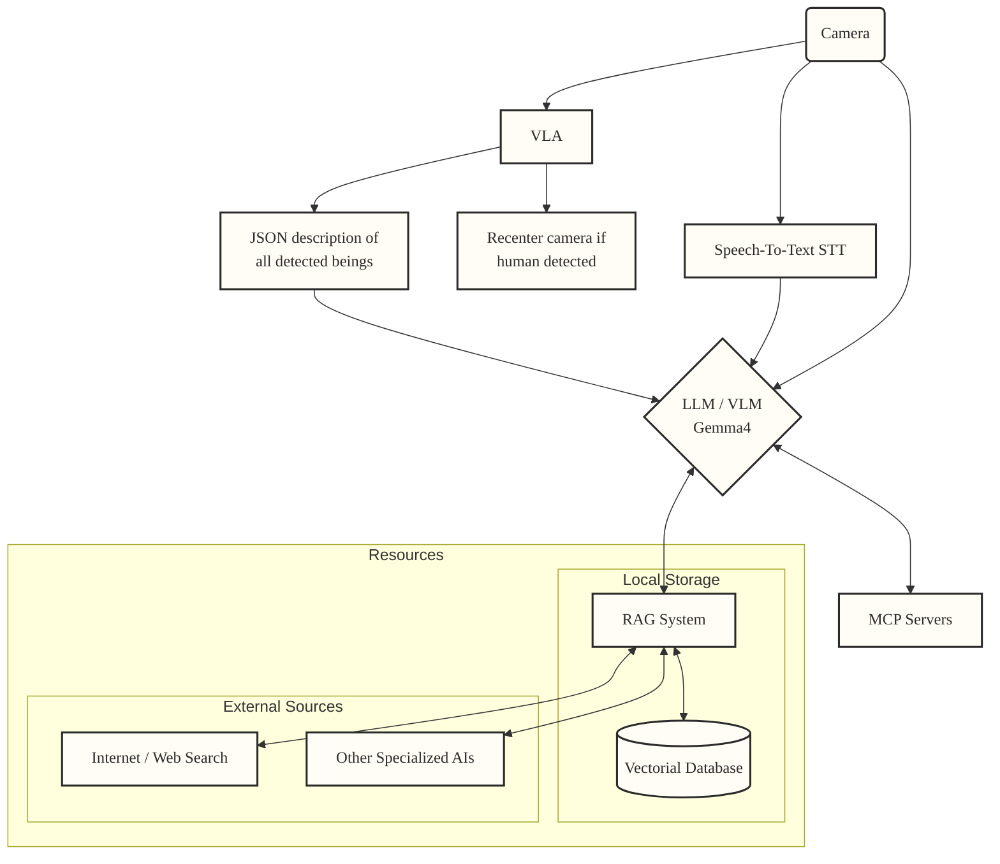

# AI-Assistant

## workflow

## links

- [jetson containers](https://github.com/dusty-nv/jetson-containers)
- [jetson ai labs](https://www.jetson-ai-lab.com)
- [Ultralytics](https://docs.ultralytics.com/guides/deepstream-nvidia-jetson#what-is-nvidia-deepstream)
